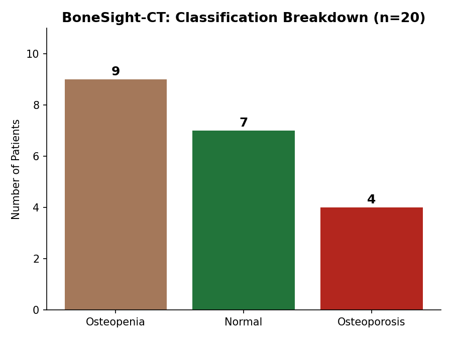
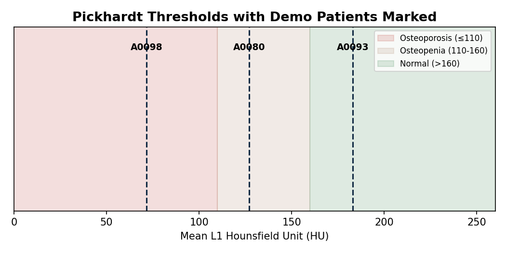
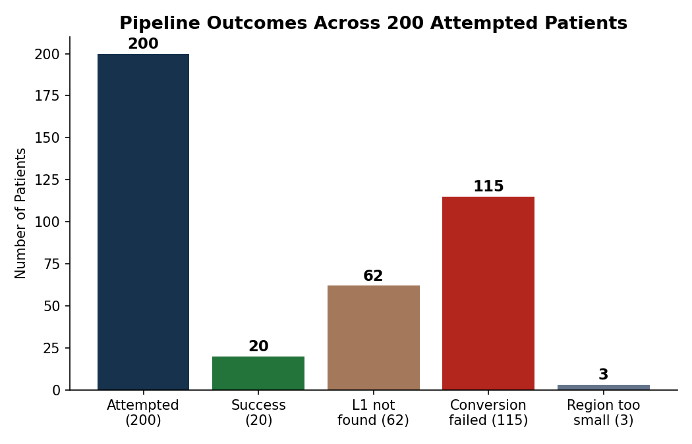

# BoneSight-CT

**Opportunistic bone density screening from a routine chest CT scan.**

*An independent research prototype built solo — no mentor, no hospital access, no institutional data — using only public data and free, open-source AI tools.*



---

## Table of Contents

- [The Story](#the-story)
- [The Problem](#the-problem)
- [What Inspired This Project](#what-inspired-this-project)
- [Background: DXA, Osteoporosis, and Osteopenia](#background-dxa-osteoporosis-and-osteopenia)
- [The Core Concept](#the-core-concept-one-modality-two-jobs)
- [Methodology](#methodology)
- [Visualization: The Image Fusion Principle](#visualization-the-image-fusion-principle)
- [The Journey: Challenges and How They Were Solved](#the-journey-challenges-and-how-they-were-solved)
- [Tools and Technologies](#tools-and-technologies)
- [Results](#results)
- [Sample Cases](#sample-cases)
- [How This Could Work in a Real Hospital](#how-this-could-work-in-a-real-hospital)
- [Why Build This At All](#why-build-this-at-all)
- [Honest Limitations](#honest-limitations)
- [Project Structure](#project-structure)
- [References](#references)
- [About](#about)

---

## The Story

This project started with a question I couldn't stop thinking about after my clinical internships: **why does bone density screening feel so out of reach for so many patients?**

During my internships at hospitals in Pakistan, I saw the access gap first-hand — outdated or broken imaging equipment, technologists working without radiation-protection dosimeters, long queues for basic scans, and a large difference between what a private hospital could offer versus a government one. In many of the smaller cities I encountered, there wasn't a single dedicated DXA (bone density) machine — not one. If a patient needed to know whether they had osteoporosis, they simply couldn't find out locally.

At the same time, I kept noticing something in the imaging data I was studying: **chest CT scans are everywhere.** They're done for lung nodules, pneumonia, cancer staging, COVID follow-up — and almost every one of them, as a side effect of the body region it covers, also captures the top of the lumbar spine (the L1 vertebra). That felt like an opportunity hiding in plain sight: what if the bone-density information was already *sitting inside* a scan that had already been done, for a completely different reason?

That question became BoneSight-CT — a project to prove, independently and on public data, that this idea actually works.

---

## The Problem

DXA scanners are the clinical gold standard for bone density, but they are far less available than CT scanners — especially outside major cities. This means osteoporosis, a condition with **no symptoms until a fracture happens**, often goes undetected in exactly the populations who need screening most: older patients in lower-resource settings.

Meanwhile, chest CT is one of the most commonly performed scans in modern hospitals. If even a fraction of these scans could be reused to flag bone density risk, patients who would otherwise never get screened could be caught early — for free, with zero extra radiation.

---

## What Inspired This Project

This project was inspired by a Taipei Medical University (TMU) study — **Kuo et al., *International Journal of Medical Informatics* (2025)** — which used a deep-learning (ViT-CNN) model to recommend DXA follow-up scans directly from chest low-dose CT images. **Dr. Yi-Tien Li** is a co-author on that paper.

I want to be transparent about exactly how this project relates to that paper: **I did not reproduce their model.** Their approach uses a custom-trained Vision Transformer-CNN hybrid, built with institutional data access and a research team. I don't have either of those things. What I *did* do is take the same underlying idea — that a chest CT contains a real, usable bone-density signal — and build my own, independent, fully transparent version of it, using a different, simpler, and already peer-reviewed method (see [Methodology](#methodology)).

I think this is actually the more honest way to show genuine interest in a professor's research line: not by claiming to replicate work I don't have the resources to replicate, but by proving I understand *why* the idea matters enough to build my own version of it, end-to-end, alone.

---

## Background: DXA, Osteoporosis, and Osteopenia

### What is a DXA scan?

**DXA (Dual-energy X-ray Absorptiometry)** is the clinical gold-standard test for bone density. It sends two X-ray beams of different energy levels through bone — usually the hip and lower spine — and measures how differently each beam is absorbed to calculate **Bone Mineral Density (BMD)**.

It's done to catch bone loss early, estimate fracture risk, diagnose osteoporosis before a fracture occurs, and monitor treatment response. The scan is quick (10–15 minutes), painless, and uses very low radiation — much lower than a standard CT.

Results are reported as a **T-score**:

| T-score | Classification |
|---|---|
| -1.0 and above | Normal |
| -1.0 to -2.5 | Osteopenia |
| Below -2.5 | Osteoporosis |

BoneSight-CT doesn't produce a T-score directly — it uses a different, CT-based HU measurement, separately validated against DXA in large studies.

### What is Osteoporosis?

A condition where bone tissue loses density and strength faster than the body can rebuild it. Bones become porous and fragile — like a sponge with larger holes — making them far more likely to fracture from even a minor fall. It's often called a "silent disease" because it has no symptoms until a fracture happens.

### What is Osteopenia?

An earlier, milder stage of bone density loss — lower than normal, but not low enough to be classified as osteoporosis. It doesn't always progress to osteoporosis, but it's a meaningful early warning sign, and catching it here gives the most room for prevention.

### Who is at risk, and why?

Osteoporosis becomes far more common with age, since bone naturally remodels more slowly over time. It's especially common in:

- **Postmenopausal women** — the drop in estrogen after menopause significantly accelerates bone loss
- **Men and women over roughly 65–70**

Other risk factors: family history of osteoporosis/fractures, low calcium or vitamin D intake, sedentary lifestyle, smoking, heavy alcohol use, low body weight, and long-term steroid use.

This matters for the project's premise: many people most at risk for osteoporosis are also the ones already getting chest CTs for other age-related conditions. The opportunity to screen is already there.

---

## The Core Concept: One Modality, Two Jobs

Normally, checking bone density requires a dedicated DXA scan — a separate machine, separate appointment, separate cost. BoneSight-CT's core idea is that a chest CT, already being done for an unrelated reason, contains enough information (the L1 vertebra) to also produce a bone-density screening signal.

**One imaging modality does the work normally split across two.**

---

## Methodology

**Dataset:** [Lung-PET-CT-Dx](https://doi.org/10.7937/TCIA.2020.NNC2-0461) (The Cancer Imaging Archive) — a public collection of real diagnostic-dose chest CT scans.

**Pipeline:**

1. **Chest CT acquisition** — a routine scan performed for an unrelated reason (already in the public dataset)
2. **Series selection** — for each patient, the CT series with the highest image count (≥150 slices) was selected, to maximize the chance L1 falls inside the scanned range
3. **DICOM → NIfTI conversion** via `dicom2nifti`
4. **L1 vertebra segmentation** via [TotalSegmentator](https://github.com/wasserth/TotalSegmentator) (`task="total"`, `fast=True`, `roi_subset=["vertebrae_L1"]`) — a free, pre-trained AI model, so no custom segmentation model had to be trained from scratch
5. **Trabecular bone isolation** — the vertebra mask is eroded by 3mm (`scipy.ndimage.binary_erosion`) to exclude the dense outer cortical shell, isolating the spongy trabecular bone most sensitive to early density loss
6. **Mean HU (Hounsfield Unit) calculation** inside that eroded trabecular region
7. **Classification** against validated thresholds:

| Mean L1 HU | Classification |
|---|---|
| ≤ 110 | Osteoporosis |
| 110 – 160 | Osteopenia |
| > 160 | Normal |

These thresholds come from **Pickhardt et al. (Radiology, 2019)**, validated against real DXA scans in a study of over 20,000 patients.



Results are saved incrementally to CSV after every patient, so progress survives Google Colab disconnects — this was a deliberate design choice after early sessions lost progress to Colab timeouts.

---

## Visualization: The Image Fusion Principle

In radiology, **image fusion** (or multimodal fusion) combines two scans so each covers the other's weakness — most commonly **PET-CT**, where a PET scan's functional/metabolic signal (e.g. "this area is metabolically active") is overlaid onto a CT scan's precise anatomical detail (exact location, shape, structure). Alone, PET shows *that* something is happening but not clearly *where*; CT shows *where* everything is but not function. Fused together, both questions get answered in one image.

The sample overlay images used in this project (see [Sample Cases](#sample-cases)) apply the same visualization principle at a smaller scale: instead of fusing two separate scans, they fuse a single CT scan with **AI-derived information about that same scan** — the TotalSegmentator-predicted L1 location — overlaid in color on top of the grayscale anatomy. It's the same underlying idea that makes PET-CT fusion clinically useful: don't just report a number, show *where on the actual scan* that number came from, so a clinician can visually verify it.

---

## The Journey: Challenges and How They Were Solved

This section exists because the failures matter as much as the final result — this is exactly what it looked like to build a medical imaging pipeline alone, without a mentor to unblock me.

### Challenge 1: No GPU, ever

All processing had to run on Colab's free CPU tier. TotalSegmentator is designed to run much faster on GPU. I worked around this using `fast=True` (which resamples to lower resolution) and `roi_subset=["vertebrae_L1"]` (which tells it to only look for one structure instead of the full body) — this brought per-patient runtime down to roughly 1–3 minutes instead of tens of minutes.

### Challenge 2: A manual DICOM converter that silently broke segmentation

Early on, I tried writing my own DICOM-to-NIfTI conversion using SimpleITK, thinking it would give me more control. It didn't work — TotalSegmentator's internal body-localizer consistently failed to find anything on these files, even though the image data itself looked completely normal when I inspected it manually. I spent a full 33-minute run on one patient (`Lung_Dx-A0075`) at full resolution, specifically to rule out a speed-related shortcut as the cause — it still found zero L1 voxels. That was the point I concluded the bug was in how my custom converter encoded the file, not in the data.

I then tried a second custom approach, hand-writing the NIfTI conversion using `pydicom` directly, to get even more control over slice ordering. This introduced a different bug — a scaling/affine transformation error that actually broke cases that had previously worked fine.

After losing significant time to both custom approaches, I went back to the original, plain `dicom2nifti` library — which worked correctly from the start. **The lesson:** sometimes the "simple, boring" library call is more reliable than a custom solution, especially without a second person to review the code.

### Challenge 3: A dataset-wide conversion bug

Even with the working `dicom2nifti` pipeline, a large fraction of patients failed conversion with the error `FileDataset object has no attribute 'RepetitionTime'`. I confirmed this is a known bug in `dicom2nifti` itself (RepetitionTime is a tag normally found in MRI files, not CT, and the library doesn't always handle its absence gracefully) — not a problem with the scan data. Rather than spend more limited time patching a third-party library, I made a deliberate decision: **log it honestly as a `conversion_failed` status and report the resulting success rate as a real finding**, instead of hiding it or over-engineering a fix.

### Challenge 4: Picking the right CT series per patient

Each patient in the dataset often has multiple CT series (different reconstructions, different slice thicknesses) under one study. Some series had as few as 39–61 images (nowhere near enough range to include L1); others had 240+ images. I standardized on selecting the series with the highest image count for each patient, which meaningfully increased the chance L1 was actually inside the scanned volume.

### Challenge 5: Making the results feel "real"

After the pipeline was numerically working, I realized a table of HU numbers doesn't actually *show* anything to someone reviewing the project. So I went back and reprocessed three representative patients (one from each category) individually, this time also saving the specific CT slice where the L1 mask had the most visible area, and overlaying the segmentation mask in red directly on top of the real scan image — turning an abstract number into something visually verifiable.

---

## Tools and Technologies

| Tool | Purpose |
|---|---|
| **Python**, Google Colab | Development environment (CPU only, no GPU) |
| `tcia_utils` / `nbia` | Downloading scans directly from The Cancer Imaging Archive |
| `dicom2nifti` | Converting raw DICOM files into NIfTI format |
| `TotalSegmentator` | Pre-trained AI model for automatic L1 vertebra segmentation |
| `nibabel` | Loading and manipulating NIfTI image data as arrays |
| `scipy.ndimage` | Morphological erosion to isolate trabecular bone |
| `numpy` | Numerical array processing throughout the pipeline |
| `pandas` | Tracking and aggregating results across all patients |
| `matplotlib` | Generating overlay visualizations and result charts |
| `Streamlit` | Building and deploying the interactive web app |

---

## Results

Out of **200 patients** attempted from the Lung-PET-CT-Dx dataset:



| Outcome | Count |
|---|---|
| ✅ Success | 20 |
| L1 not found in scan range | 62 |
| Segmented region too small | 3 |
| DICOM conversion failed | 115 |

Of the **20 successful patients**:

| Classification | Count |
|---|---|
| Osteopenia | 9 |
| Normal | 7 |
| Osteoporosis | 4 |

Mean HU across successful patients ranged from **71.6 to 241.8** (mean 145.1, std 46.4) — a genuine spread across all three categories, indicating the pipeline captures real biological variation rather than collapsing to one dominant class.

---

## Sample Cases

Three real, de-identified patients from the dataset — one from each classification category — processed individually with their L1 vertebra visually highlighted on the original CT slice:

| Patient | Mean HU | Classification | Overlay |
|---|---|---|---|
| Lung_Dx-A0098 | 71.65 | Osteoporosis | `sample_images/Lung_Dx-A0098_overlay.png` |
| Lung_Dx-A0080 | 127.11 | Osteopenia | `sample_images/Lung_Dx-A0080_overlay.png` |
| Lung_Dx-A0093 | 183.03 | Normal | `sample_images/Lung_Dx-A0093_overlay.png` |

*(See the `sample_images/` folder or the live app's Demos tab for the actual overlay images — original scan alongside the AI-segmented L1 vertebra highlighted in red.)*

---

## How This Could Work in a Real Hospital

This prototype classifies one HU value at a time. A realistic future clinical workflow would look like this:

1. **Automatic trigger** — every chest CT sent to a hospital's imaging system (PACS) is automatically checked for whether L1 is inside the scanned range.
2. **Background processing** — if it is, the L1-HU pipeline runs quietly in the background — no extra scan, no patient wait.
3. **Report addendum** — if the result falls in the Osteopenia or Osteoporosis range, a flag is added to the radiologist's report as a *suggestion*, not an automatic diagnosis.
4. **Radiologist review** — the radiologist decides, using clinical judgment and the patient's history, whether to recommend a formal DXA scan.
5. **Referral, especially where DXA is scarce** — in hospitals without a DXA machine, this flag becomes even more valuable: it can prompt a referral elsewhere, instead of bone loss going undetected entirely.

The tool's role stays deliberately limited: it surfaces a signal for a qualified clinician to act on. **It never diagnoses or replaces DXA.**

---

## Why Build This At All

The purpose isn't to replace DXA or radiologists. It's to close a real accessibility gap: chest CT scanners are far more widely available than DXA machines, especially in smaller cities and lower-resource hospitals. Every chest CT that already includes L1 is a missed opportunity for a free bone-density signal if nobody looks at it that way.

This project exists to show — honestly, with real data and real limitations reported — that a validated, published method (not a black-box model) can be built end-to-end by a single student, on public data, without a hospital or mentor, and still produce a genuinely useful, clinically-grounded screening signal.

---

## Honest Limitations

- **No DXA ground truth**: this dataset has no matched DXA scans for the same patients, so classification relies on published thresholds, not verification against gold-standard measurements on these exact patients.
- **~10% technical success rate**: of 200 patients attempted, only 20 produced a usable measurement — mostly because L1 fell outside the scan range, or the known `dicom2nifti` conversion bug described above.
- **Simple threshold approach**: the inspiring TMU paper (Kuo et al. 2025) uses a more advanced ViT-CNN model; this project intentionally uses a simpler, transparent threshold method suited to a solo, no-mentor student timeline.
- **Small sample size**: 20 patients demonstrates feasibility, not clinical validity.

---

## Project Structure

```
bonesight-ct/
├── app.py                     # Streamlit app
├── requirements.txt           # Python dependencies
├── bonesight_results.csv      # Final results (20 patients)
├── images/                    # README charts
│   ├── classification_breakdown.png
│   ├── pipeline_outcomes.png
│   └── hu_thresholds.png
└── sample_images/             # Demo overlay images (3 patients)
    ├── Lung_Dx-A0098_overlay.png
    ├── Lung_Dx-A0080_overlay.png
    └── Lung_Dx-A0093_overlay.png
```

---

## References

- Pickhardt, P.J., et al. *Automated CT-based Opportunistic Osteoporosis Screening.* Radiology (2019).
- Kuo, C.Y., et al. *Deep learning chest LDCT to DXA recommendation.* International Journal of Medical Informatics (2025).
- World Health Organization. *WHO Criteria for the Diagnosis of Osteoporosis* (T-score classification, based on DXA BMD measurement).
- International Osteoporosis Foundation — patient-facing reference on DXA scanning, osteoporosis, and osteopenia.
- National Institutes of Health (NIH) — Lung-PET-CT-Dx dataset, The Cancer Imaging Archive. [DOI: 10.7937/TCIA.2020.NNC2-0461](https://doi.org/10.7937/TCIA.2020.NNC2-0461)

---

## About

Built independently by **Zainab Fatima**, a BS Medical Imaging Technology student, without institutional data access or a mentor, using the public Lung-PET-CT-Dx dataset (The Cancer Imaging Archive).

> ⚠️ **Research/student prototype only.** This tool is not clinically validated and must not be used to diagnose patients or replace a formal DXA scan.
